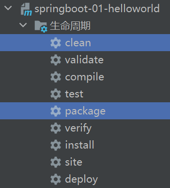
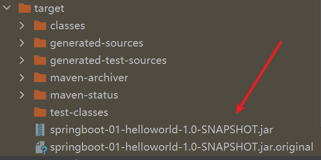
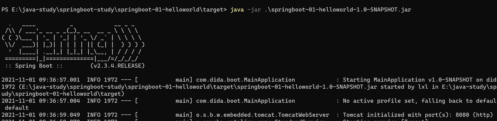
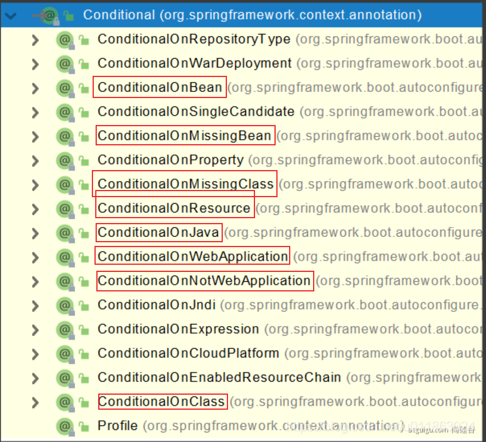

# SpringBoot

## 资料

- [Spring Boot官网](https://spring.io/projects/spring-boot)
- [Spring Boot官方文档](https://docs.spring.io/spring-boot/docs/)
- [本课程文档地址](https://www.yuque.com/atguigu/springboot)
- [视频地址1](http://www.gulixueyuan.com/)、[视频地址2](https://www.bilibili.com/video/BV19K4y1L7MT?p=1)
- [源码地址](https://gitee.com/leifengyang/springboot2)

## 1.spring生态圈

### spring生态

- web开发
- 数据访问
- 安全控制
- 分布式
- 消息服务
- 移动开发
- 批处理
- …

### 响应式编程


### 为什么使用springboot

> Spring Boot makes it easy to create stand-alone, production-grade Spring based Applications that you can “just run”.link
>
> 能快速创建出生产级别的Spring应用。

### 优点

* Create stand-alone Spring applications
  - 创建独立Spring应用
* Embed Tomcat, Jetty or Undertow directly (no need to deploy WAR files)
  - 内嵌web服务器
* Provide opinionated ‘starter’ dependencies to simplify your build configuration
  * 自动starter依赖，简化构建配置
* Automatically configure Spring and 3rd party libraries whenever possible
  - 自动配置Spring以及第三方功能
* Provide production-ready features such as metrics, health checks, and externalized configuration
  - 提供生产级别的监控、健康检查及外部化配置
* Absolutely no code generation and no requirement for XML configuration
  - 无代码生成、无需编写XML
* SpringBoot是整合Spring技术栈的一站式框
* SpringBoot是简化Spring技术栈的快速开发脚手架

### SpringBoot缺点

- 人称版本帝，迭代快，需要时刻关注变化
- 封装太深，内部原理复杂，不容易精通

## 2.hello,world

#### 导入父依赖

```xml
    <parent>
        <groupId>org.springframework.boot</groupId>
        <artifactId>spring-boot-starter-parent</artifactId>
        <version>2.3.4.RELEASE</version>
    </parent>

```

#### 导入web模块

```xml
    <dependencies>
        <dependency>
            <groupId>org.springframework.boot</groupId>
            <artifactId>spring-boot-starter-web</artifactId>
        </dependency>
    </dependencies>
```

#### 编写启动类

```java
@SpringBootApplication
public class MainApplication {
    public static void main(String[] args) {
        SpringApplication.run(MainApplication.class,args);
    }
}
```

#### 编写业务

```java
@Controller
public class HelloController {
    @ResponseBody
    @RequestMapping("/hello")
    public String handle01(){
        return "Hello,Spring Boot 2!";
    }
}
```

#### 编写配置文件

在application.properties中可以配置不同的配置文件

#### 打jar包



选中clean和package后运行

生成的jar包在target文件夹中



运行jar包



## 3.依赖管理特性

父项目

```xml
依赖管理    
<parent>
        <groupId>org.springframework.boot</groupId>
        <artifactId>spring-boot-starter-parent</artifactId>
        <version>2.3.4.RELEASE</version>
    </parent>
父依赖
  <parent>
    <groupId>org.springframework.boot</groupId>
    <artifactId>spring-boot-dependencies</artifactId>
    <version>2.3.4.RELEASE</version>
  </parent>
几乎声明了所有开发中用到的以来的版本号，通过自动版本仲裁机制
```

### 其他starter场景启动器

格式：spring-boot-starter-* , *代表场景

引入了starter就会自动引入场景需要的依赖

*-spring-boot-starter-，表示第三方为我们提供的简化开发的场景启动器

[更多SpringBoot所有支持的场景](https://docs.spring.io/spring-boot/docs/current/reference/html/using-spring-boot.html#using-boot-starter)

### 场景启动器最底层的依赖

```xml
所有场景启动器最底层的依赖
<dependency>
	<groupId>org.springframework.boot</groupId>
	<artifactId>spring-boot-starter</artifactId>
	<version>2.3.4.RELEASE</version>
	<scope>compile</scope>
</dependency>
```

场景不需要版本号，自动版本仲裁

	1. 引入以来默认都可以不用写版本号
	2. 引入非版本仲裁的jar需要写版本号

可以修改默认的版本号

1. 查看spring-boot-dependencies里面规定当前依赖的版本 用的 key。
2. 重写配置

```xml
<properties>
	<mysql.version>5.1.43</mysql.version>
</properties>
```

## 4.自动配置特性

### web环境自动配置

tomcat

```xml
<dependency>
  <groupId>org.springframework.boot</groupId>
  <artifactId>spring-boot-starter-tomcat</artifactId>
  <version>2.3.4.RELEASE</version>
  <scope>compile</scope>
</dependency>
```

maven

自动配置web的常见功能，比如字符编码等问题

```xml
<dependency>
  <groupId>org.springframework</groupId>
  <artifactId>spring-webmvc</artifactId>
  <version>5.2.9.RELEASE</version>
  <scope>compile</scope>
</dependency>
```

web

```xml
<dependency>
  <groupId>org.springframework</groupId>
  <artifactId>spring-web</artifactId>
  <version>5.2.9.RELEASE</version>
  <scope>compile</scope>
</dependency>
```

### 默认的包结构

* 主程序会扫描所在包和子包的组件
* 可以改变扫描的路径
  * @SpringBootApplication(scanBasePackages=“com.lun”)

```java
@Target({ElementType.TYPE})
@Retention(RetentionPolicy.RUNTIME)
@Documented
@Inherited
@SpringBootConfiguration
@EnableAutoConfiguration
@ComponentScan(
    excludeFilters = {@Filter(
    type = FilterType.CUSTOM,
    classes = {TypeExcludeFilter.class}
), @Filter(
    type = FilterType.CUSTOM,
    classes = {AutoConfigurationExcludeFilter.class}
)}
)
public @interface SpringBootApplication
```

各种配置都有默认值

​	默认的配置会映射到某一个类上

​	配置文件的值会绑定到每一个类上，这个类会在容器 里创建对象

使用了场景会开启那个场景的自动配置功能

### 自动配置注解

#### @Configuration

config

```java
@Configuration(proxyBeanMethods = true)
public class HelloConfig {
    @Bean
    public User user01(){
        User zhangsan = new User("zhangsan", 17);
        zhangsan.setPet(tomcatPet());
        return zhangsan;
    }
    @Bean("tom")
    public Pet tomcatPet(){
        return new Pet("tomcat");
    }
}
```

main

```java
@SpringBootApplication
public class MainApplication {
    public static void main(String[] args) {
        //返回IOC容器
        ConfigurableApplicationContext run = SpringApplication.run(MainApplication.class, args);

        //从容器中获取组件
        Pet tom01 = run.getBean("tom", Pet.class);
        Pet tom02 = run.getBean("tom", Pet.class);
        System.out.println("组件"+(tom01 == tom02));
    //com.dida.boot.config.HelloConfig$$EnhancerBySpringCGLIB$$9994cf6e@3c818ac4
        HelloConfig bean = run.getBean(HelloConfig.class);
        System.out.println(bean);

//如果@Configuration(proxyBeanMethods = true)代理对象调用方法。SpringBoot总会检查这个组件是否在容器中有。
        //保持组件单实例
        User user01 = bean.user01();
        User user02 = bean.user01();
        System.out.println(user01 == user02);

        User user = run.getBean("user01", User.class);
        Pet tom = run.getBean("tom", Pet.class);

        System.out.println("用户的宠物："+(user.getPet() == tom));
    }
}
```

1. 配置类里面使用@Bean注解标注在方法上给容器注册组件
2. 配置类本身也是组件
3. proxyBeanMethods：代理bean的方法
         Full(proxyBeanMethods = true) 保证每个@Bean方法被调用多少次返回的组件都是单实例的
         Lite(proxyBeanMethods = false)每个@Bean方法被调用多少次返回的组件都是新创建的

- 配置 类组件之间**无依赖关系**用Lite模式加速容器启动过程，减少判断
- 配置 类组件之间**有依赖关系**，方法会被调用得到之前单实例组件，用Full模式（默认）

#### @Import

给容器中**自动创建出这个类型的组件**、默认组件的名字就是全类名

在config类上写

```java
@Import({User.class})
```

在主程序调用

```java
 String[] beanNamesForType = run.getBeanNamesForType(User.class);
        for (String s : beanNamesForType) {
            System.out.println(s);
        }
```

输出

```
=================
com.dida.boot.pojo.User
user01
```

说明注入成功了

#### @Conditional

满足了conditional指定的条件才进行组件注入



#### @importResource

导入配置文件

#### @ConfigurationProperties

读取配置文件中的信息

## 自动配置总结

* 先加载所有的自动配置类

* 自动配置类按照条件生效，默认会绑定配置文件中指定的值。

* 生效的配置类会给容器中装配组件

* 有组件就代表有容器

* 定制化配置

  * 用户自己添加组件去代替底层的组件

  流程

  ​	**xxxxxAutoConfiguration —> 组件 —> xxxxProperties里面拿值 ----> application.properties**

## 5.编写springboot

* 引入场景依赖
* 查看自动配置了哪些
  * 自己分析
  * 配置文件中debug=true开启debug模式
    * Negative不生效的
    * Positive生效的
* 是否需要修改
  * 修改配置项
    * 官方文档
    * 底层源码
  * 自定义加入或者替换组件
  * 自定义器

## 6.dev-tools

不用重启项目使用ctrl+F9即可

```xml
<dependencies>
    <dependency>
        <groupId>org.springframework.boot</groupId>
        <artifactId>spring-boot-devtools</artifactId>
        <optional>true</optional>
    </dependency>
</dependencies>

```

## 7.yaml

*YAML*是"YAML Ain't a Markup Language"（YAML不是一种[标记语言](https://baike.baidu.com/item/标记语言)）的[递归缩写](https://baike.baidu.com/item/递归缩写)。

- 大小写敏感
- 使用缩进表示层级关系
- 缩进时不允许使用Tab键，只允许使用空格。(idea中科院)
- 缩进的空格数目不重要，只要相同层级的元素左侧对齐即可
- #表示注释
- 字符串无需加引号，如果要加，单引号’’、双引号""表示字符串内容会被 转义、不转义

采用key: value的键值对方式

### 使用yaml代替properties配置文件来表示各种类型的对象

#### 定义实体类

```java
@Data
@Component
@ConfigurationProperties(prefix = "person")
public class Person {
    private String userName;
    private Boolean boss;
    private Date birth;
    private Integer age;
    private Pet pet;
    private String[] interests;
    private List<String> animal;
    private Map<String, Object> score;
    private Set<Double> salarys;
    private Map<String, List<Pet>> allPets;
}
```

```java
@Data
public class Pet {
    private String name;
    private Double weight;
}
```

#### yaml配置文件

```yaml
person:
  userName: zhangsan
  boss: false
  birth: 2021/23/12 24:2:33
  age: 17
  pet:
    name: miao
    weight: 11.1
  interests: [足球,排球]
  animle:
    - jerry
    - mario
  score:
    english:
      first: 22
      second: 55
      third: 99
    math: [131,140,148]
    chinese: {first: 128,second: 138}
  salarys: [23333,55555,67778.22]
  allPets:
    sick:
      - {name: tom}
      - {name: jerry,weight: 47}
    helth: [{name: mario,weight: 47}]
```

