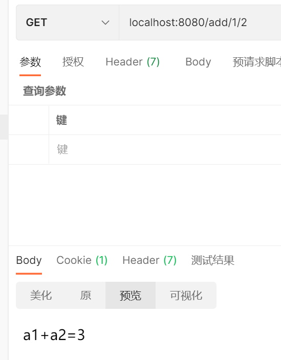

# 1.简介

> Spring MVC 是 Spring 提供的一个基于 MVC 设计模式的轻量级 Web 开发框架，本质上相当于 Servlet。

## MVC

>  MVC即**Model**、**View**、**Controller**即模型、视图、控制器。
>
> 使用MVC的目的是将M和V的实现代码分离，从而使同一个程序可以使用不同的表现形式

### 内容

#### 模型(Model)

M即model模型是指模型表示业务规则。在MVC的三个部件中，模型拥有最多的处理任务。被模型返回的数据是中立的，模型与数据格式无关，这样一个模型能为多个视图提供数据，由于应用于模型的代码只需写一次就可以被多个视图重用，所以减少了代码的重复性。

#### 视图(View)

V即View视图是指用户看到并与之交互的界面。比如由html元素组成的网页界面，或者软件的客户端界面。MVC的好处之一在于它能为应用程序处理很多不同的视图。在视图中其实没有真正的处理发生，它只是作为一种输出数据并允许用户操作的方式。

#### 控制器(Controller)

C即controller控制器是指控制器接受用户的输入并调用模型和视图去完成用户的需求，控制器本身不输出任何东西和做任何处理。它只是接收请求并决定调用哪个模型构件去处理请求，然后再确定用哪个视图来显示返回的数据。

### 特点

1. 耦合性低
2. 重用性高
3. 部署快，生命周期成本低
4. 可维护性高

### model1和model2时代

#### model1

不完全实现MVC模式

view层和controller层合二为一使用jsp


##### 缺点

* jsp职责太重
* 代码耦合性高
* 不方便后期维护
* 代码重用性低

#### model2

完全实现了MVC模式

将逻辑控制放在Servlet，让他来做Controller的工作减少jsp的代码量。

在model2中，jsp只负责显示页面，生成动态网页。

在Model2模式中，JSP相当于View的角色，Servlet做的Controller的工作，JavaBeans做的Model层的工作。


代码的复用性提高，后期方便维护

### 实现一个Servlet程序

#### 创建servlet

```java
public class HelloServlet extends HttpServlet {
    @Override
    protected void doGet(HttpServletRequest req, HttpServletResponse resp) throws ServletException, IOException {
        //获得前端数据
        String method = req.getParameter("method");
        if (method.equals("add")){
            req.getSession().setAttribute("msg","执行了add方法");
        }
        if (method.equals("delete")){
            req.getSession().setAttribute("msg","执行了delete方法");
        }
        //业务逻辑选择合适的模型层
        //跳转视图
        req.getRequestDispatcher("/WEB-INF/jsp/hello.jsp").forward(req,resp);
    }

    @Override
    protected void doPost(HttpServletRequest req, HttpServletResponse resp) throws ServletException, IOException {
        doGet(req, resp);
    }
}
```

#### 注册web.xml

```xml
    <servlet>
        <servlet-name>HelloServlet</servlet-name>
        <servlet-class>com.dida.controller.HelloServlet</servlet-class>
    </servlet>
    <servlet-mapping>
        <servlet-name>HelloServlet</servlet-name>
        <url-pattern>/hello</url-pattern>
    </servlet-mapping>
```

#### 创建hello.xml

```jsp
<%@ page contentType="text/html;charset=UTF-8" language="java" %>
<html>
<head>
    <title>dida</title>
</head>
<body>
    ${msg}
</body>
</html>
```

## 为什么要学spring mvc

Spring Web MVC 是最初建立在 Servlet API 之上的 Web 框架

1. 轻量级、简单易学
2. 高效，基于请求响应的MVC框架
3. 与spring兼容性好
4. 约定优于配置
5. 功能强大
6. 简洁灵活

# 2.spring mvc

## DispatcherServlet

springweb框架围绕DispatcherServlet来设计

作用：将请求分发到不同的处理器。

DispatcherServlet实际是一个servlet（继承了servlet）


## Spring MVC原理

当发起请求时被前置的控制器拦截到请求，根据请求参数生成代理请求，找到请求对应的实际控制器，控制器处理请求，创建数据模型，访问数据库，将模型响应给中心控制器，控制器使用模型与视图渲染视图结果，将结果返回给中心控制器，再将结果返回给请求者。


## 第一个spring mvc

web.xml

```xml
<?xml version="1.0" encoding="UTF-8"?>
<web-app xmlns="http://xmlns.jcp.org/xml/ns/javaee"
         xmlns:xsi="http://www.w3.org/2001/XMLSchema-instance"
         xsi:schemaLocation="http://xmlns.jcp.org/xml/ns/javaee http://xmlns.jcp.org/xml/ns/javaee/web-app_4_0.xsd"
         version="4.0">
    <!--1.注册DispatcherServlet-->
    <servlet>
        <servlet-name>springmvc</servlet-name>
        <servlet-class>org.springframework.web.servlet.DispatcherServlet</servlet-class>
        <!--关联一个springmvc的配置文件:【servlet-name】-servlet.xml-->
        <init-param>
            <param-name>contextConfigLocation</param-name>
            <param-value>classpath:springmvc-servlet.xml</param-value>
        </init-param>
        <!--启动级别-1-->
        <load-on-startup>1</load-on-startup>
    </servlet>

    <!--/ 匹配所有的请求；（不包括.jsp）-->
    <!--/* 匹配所有的请求；（包括.jsp）-->
    <servlet-mapping>
        <servlet-name>springmvc</servlet-name>
        <url-pattern>/</url-pattern>
    </servlet-mapping>
</web-app>
```

springmvc配置文件

```xml
<?xml version="1.0" encoding="UTF-8"?>
<beans xmlns="http://www.springframework.org/schema/beans"
       xmlns:xsi="http://www.w3.org/2001/XMLSchema-instance"
       xsi:schemaLocation="http://www.springframework.org/schema/beans
       http://www.springframework.org/schema/beans/spring-beans.xsd">

    <bean class="org.springframework.web.servlet.handler.BeanNameUrlHandlerMapping"/>
    <bean class="org.springframework.web.servlet.mvc.SimpleControllerHandlerAdapter"/>

    <!--视图解析器:DispatcherServlet给他的ModelAndView-->
    <bean class="org.springframework.web.servlet.view.InternalResourceViewResolver" id="InternalResourceViewResolver">
        <!--前缀-->
        <property name="prefix" value="/WEB-INF/jsp/"/>
        <!--后缀-->
        <property name="suffix" value=".jsp"/>
    </bean>
    <bean id="/hello" class="com.dida.controller.HelloController"/>

</beans>
```

controller控制器

```java
public class HelloController implements Controller {
    @Override
    public ModelAndView handleRequest(HttpServletRequest request, HttpServletResponse response) throws Exception {
        ModelAndView modelAndView = new ModelAndView();
        modelAndView.addObject("msg","HelloMVC");

        modelAndView.setViewName("hello");
        return modelAndView;
    }
}
```

jsp

```jsp
<%@ page contentType="text/html;charset=UTF-8" language="java" %>
<html>
<head>
    <title>Title</title>
</head>
<body>
${msg}
</body>
</html>
```

### 出现404的问题

项目结构中创建lib目录导入jar包

# 3.spring mvc执行原理


虚线为手动操作，实现为mvc自动操作

## **简要分析执行流程**

1. 1. DispatcherServlet表示前置控制器，是整个SpringMVC的控制中心。用户发出请求，DispatcherServlet接收请求并拦截请求。

      我们假设请求的url为 : http://localhost:8080/SpringMVC/hello

       

      **如上url拆分成三部分：**

      http://localhost:8080服务器域名

      SpringMVC部署在服务器上的web站点

      hello表示控制器

      通过分析，如上url表示为：请求位于服务器localhost:8080上的SpringMVC站点的hello控制器。

   2. HandlerMapping为处理器映射。DispatcherServlet调用HandlerMapping,HandlerMapping根据请求url查找Handler。

   3. HandlerExecution表示具体的Handler,其主要作用是根据url查找控制器，如上url被查找控制器为：hello。

   4. HandlerExecution将解析后的信息传递给DispatcherServlet,如解析控制器映射等。

   5. HandlerAdapter表示处理器适配器，其按照特定的规则去执行Handler。

   6. Handler让具体的Controller执行。

   7. Controller将具体的执行信息返回给HandlerAdapter,如ModelAndView。

   8. HandlerAdapter将视图逻辑名或模型传递给DispatcherServlet。

   9. DispatcherServlet调用视图解析器(ViewResolver)来解析HandlerAdapter传递的逻辑视图名。

   10. 视图解析器将解析的逻辑视图名传给DispatcherServlet。

   11. DispatcherServlet根据视图解析器解析的视图结果，调用具体的视图。

   12. 最终视图呈现给用户。

# 4.注解开发SpringMVC

## 项目步骤

### 创建一个模块，添加web支持

### 完善maven配置（确保能读取到配置文件）

```xml
<build>
   <resources>
       <resource>
           <directory>src/main/java</directory>
           <includes>
               <include>**/*.properties</include>
               <include>**/*.xml</include>
           </includes>
           <filtering>false</filtering>
       </resource>
       <resource>
           <directory>src/main/resources</directory>
           <includes>
               <include>**/*.properties</include>
               <include>**/*.xml</include>
           </includes>
           <filtering>false</filtering>
       </resource>
   </resources>
</build>

```

### 配置web.xml

```xml
<?xml version="1.0" encoding="UTF-8"?>
<web-app xmlns="http://xmlns.jcp.org/xml/ns/javaee"
         xmlns:xsi="http://www.w3.org/2001/XMLSchema-instance"
         xsi:schemaLocation="http://xmlns.jcp.org/xml/ns/javaee http://xmlns.jcp.org/xml/ns/javaee/web-app_4_0.xsd"
         version="4.0">
<!--注册DispatcherServlet-->
    <servlet>
        <servlet-name>SpringMVC</servlet-name>
        <servlet-class>org.springframework.web.servlet.DispatcherServlet</servlet-class>
<!--初始化参数指定配置文件的位置
关联配置文件-->
        <init-param>
            <param-name>contextConfigLocation</param-name>
            <param-value>classpath:springmvc-servlet.xml</param-value>
        </init-param>
<!--设置启动顺序，数字越小越先启动-->
        <load-on-startup>1</load-on-startup>
    </servlet>

<!--所有的请求都被mvc拦截-->
    <servlet-mapping>
        <servlet-name>SpringMVC</servlet-name>
        <url-pattern>/</url-pattern>
    </servlet-mapping>
<!--    
< url-pattern > / </ url-pattern > 不会匹配到.jsp， 只针对我们编写的请求；即：.jsp 不会进入spring的 DispatcherServlet类 。
< url-pattern > /* </ url-pattern > 会匹配 *.jsp，会出现返回 jsp视图 时再次进入spring的DispatcherServlet 类，导致找不到对应的controller所以报404错。
-->
</web-app>
```

### 根据web.xml编写spring的配置文件

```xml
<?xml version="1.0" encoding="UTF-8"?>
<beans xmlns="http://www.springframework.org/schema/beans"
      xmlns:xsi="http://www.w3.org/2001/XMLSchema-instance"
      xmlns:context="http://www.springframework.org/schema/context"
      xmlns:mvc="http://www.springframework.org/schema/mvc"
      xsi:schemaLocation="http://www.springframework.org/schema/beans
       http://www.springframework.org/schema/beans/spring-beans.xsd
       http://www.springframework.org/schema/context
       https://www.springframework.org/schema/context/spring-context.xsd
       http://www.springframework.org/schema/mvc
       https://www.springframework.org/schema/mvc/spring-mvc.xsd">

   <!-- 自动扫描包，让指定包下的注解生效,由IOC容器统一管理 -->
   <context:component-scan base-package="nuc.ss.controller"/>
   <!-- 让Spring MVC不处理静态资源 -->
   <mvc:default-servlet-handler />
   <!--
   支持mvc注解驱动
       在spring中一般采用@RequestMapping注解来完成映射关系
       要想使@RequestMapping注解生效
       必须向上下文中注册DefaultAnnotationHandlerMapping
       和一个AnnotationMethodHandlerAdapter实例
       这两个实例分别在类级别和方法级别处理。
       而annotation-driven配置帮助我们自动完成上述两个实例的注入。
    -->
   <mvc:annotation-driven />

   <!-- 视图解析器 -->
   <bean class="org.springframework.web.servlet.view.InternalResourceViewResolver"
         id="internalResourceViewResolver">
       <!-- 前缀 -->
       <property name="prefix" value="/WEB-INF/jsp/" />
       <!-- 后缀 -->
       <property name="suffix" value=".jsp" />
   </bean>

</beans>
```

使用两条配置让springmvc不读取静态资源和读取到包下的注解

视图解析器用来拼接路径得到jsp文件的路径

### 创建controller

```java
@Controller
@RequestMapping("/HelloController")
public class HelloController {

    @RequestMapping("/hello")
    public String   sayHello(Model model){
        model.addAttribute("msg","hello,springmvc");
        return "hello";
    }
}
```

#### 注解解析

@Controller：@comment注解的衍生，为了让spring IOC容器初始化时扫描到这个类

@RequestMapping()：为了映射请求路径

#### model类型

把action的数据带到视图中

经过视图解析器的拼接得到完整的路径，将数据写入到视图中。

### 视图层构建

```jsp
<%@ page contentType="text/html;charset=UTF-8" language="java" %>
<html>
<head>
   <title>SpringMVC</title>
</head>
<body>
${msg}
</body>
</html>
```

## 总结

使用springMVC必须配置的三大件

**处理器映射器、处理器适配器、视图解析器**

通常，我们只需要**手动配置视图解析器**，而**处理器映射器**和**处理器适配器**只需要开启**注解驱动**即可，而省去了大段的xml配置

# 5.Restful风格和控制器

## 控制器Controller

控制器由注解定义和接口定义来实现

控制器负责 解析用户的请求并转换为模型

控制器类可以包含多个方法

### 使用接口来实现controller

```java
/**
 * @ClassName Controller
 * @Description 使用普通方法(实现接口)创建controller
 * @Author lxl
 * @Date 2021/10/27
 * @Version 1.0
 **/
public class ControllerTest01 implements Controller {
    @Override
    public ModelAndView handleRequest(HttpServletRequest request, HttpServletResponse response) throws Exception {
        ModelAndView mv = new ModelAndView();
        mv.addObject("msg","TestController01");
        mv.setViewName("hello");
        return mv;
    }
```

### 使用注解实现controller

```java 
/**
 * @ClassName ControllerTest02
 * @Description 使用注解实现controller
 * @Author lxl 以便后人阅读我的代码
 * @Date 2021/10/27
 * @Version 1.0
 **/
@Controller
public class ControllerTest02 {

    @RequestMapping("/t2")
    public String controllerTest02(Model model){
        model.addAttribute("msg","controllerTest02");
        return "hello";
    }
}
```

要开启配置文件中的扫描包下注解

```xml
<!-- 自动扫描指定的包，下面所有注解类交给IOC容器管理 -->   
<context:component-scan base-package="com.dida.controller"/>
```

## RequestMapping

用于映射到控制器类或一个特定的处理程序方法。可用于类或方法上。

用于类上，表示所有的响应请求的方法都是以该路径作为父路径

```java
@Controller
@RequestMapping("/test02")
public class ControllerTest02 {
    @RequestMapping("/t2")
    public String controllerTest02(Model model){
        model.addAttribute("msg","controllerTest02");
        return "hello";
    }
}
```

## Restful风格

restful是一种风格，基于这个风格设计的软件可以更简洁，更有层次，更易于实现缓存等机制。

### 传统方式：只能使用post和get方法

 http://127.0.0.1/item/queryItem.action?id=1 查询,GET

 http://127.0.0.1/item/saveItem.action 新增,POST

 http://127.0.0.1/item/updateItem.action 更新,POST

 http://127.0.0.1/item/deleteItem.action?id=1 删除,GET或POST

### restful操作资源：可以通过不同的请求方式来实现（地址一样但是请求的功能不同）

 http://127.0.0.1/item/1 查询,GET

 http://127.0.0.1/item 新增,POST

 http://127.0.0.1/item 更新,PUT

 http://127.0.0.1/item/1 删除,DELETE

### 实例测试

```Java
@Controller
public class RestfulController {
    @RequestMapping("/add/{a1}/{a2}")
    public String Test01(@PathVariable int a1, @PathVariable int a2, Model model){

        int result = a1+a2;

        model.addAttribute("msg","a1+a2="+result);

        return "hello";
    }
}
```

@PathVariable：将路径上的变量引用到参数中



### 使用路径变量的好处

* 路径简洁
* 获得参数方便
* 安全性

### 指定请求类型

```java
@RequestMapping(value = "/add/{a1}/{a2}",method = RequestMethod.POST)
```

可以使用注解来指定请求类型

```Java
@GetMapping
@PostMapping
@PutMapping
@DeleteMapping
@PatchMapping
```

例

```java
@PostMapping = @RequestMapping(value = "/add/{a1}/{a2}",method = RequestMethod.POST)
```

# 6.结果跳转方式

## ModelAndView

设置model对象根据view名称，和视图解析器跳到指定对象

```xml
<!-- 视图解析器 -->
<bean class="org.springframework.web.servlet.view.InternalResourceViewResolver"
     id="internalResourceViewResolver">
   <!-- 前缀 -->
   <property name="prefix" value="/WEB-INF/jsp/" />
   <!-- 后缀 -->
   <property name="suffix" value=".jsp" />
</bean>
```

```java
public class ControllerTest1 implements Controller {

   public ModelAndView handleRequest(HttpServletRequest httpServletRequest, HttpServletResponse httpServletResponse) throws Exception {
       //返回一个模型视图对象
       ModelAndView mv = new ModelAndView();
       mv.addObject("msg","ControllerTest1");
       mv.setViewName("test");
       return mv;
  }
}
```

## 使用servletAPI

设置servletAPI不需要视图解析器

